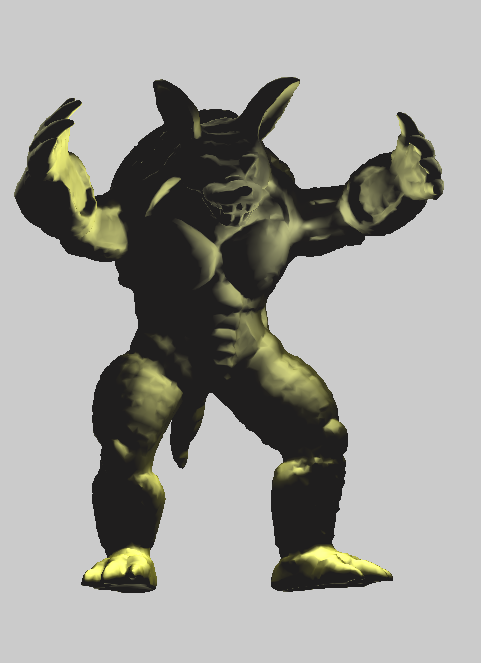

# Assignment 3


### Renderer::InitOpenGLRendering()

This function is used to construct texture coordinate and to specify the mapping and how is the texture is displayed.

The use for this function is to handle the screen as  two triangles and map the colors in each triangle using the texture that was defined in the swap buffer function using the color_buffer_.

We declare two arrays, one (vtc)  defines the coordinates of the screen "model" that we want to map, the other  (tex) defines the coordinates of the texture that we are going to map into.

we dynamically allocate memory on the GPU, for the new buffer with size of  sizeof(vtc)+sizeof(tex) , and then we set the data of the two arrays we defined earlier.

We initialize the  shaders and bind them to the current program,  we send the screen coordinates (which were defined in the vtc array)  to vPosition ,   we send the mapping coordinates (which were defined in the tex array)  to vTexCoord , both to the vertex shader.

Vertex shader sends screen coordinates to fragment shader  that uses vTexCoord  to map the texture to the screen using textureLod().

### Vertex Shader Code

```glsl
#version 330 core

layout(location = 0) in vec3 pos;
layout(location = 1) in vec3 normal;
layout(location = 2) in vec2 texCoords;

// The model/view/projection matrices
uniform mat4 model;	//inverse(modelWorldTransformation)*modelTransformation
uniform mat4 view;	// viewVolumeTransformation
uniform mat4 projection;	// AfterProjectTransforamtion * projectionTransformation

uniform mat4 scale;
uniform mat4 modelTransformation;
uniform mat4 inverserCameraTransformation;
uniform mat4 viewVolumeTransformation;

uniform mat4 finalTransformation;
uniform mat4 normalTransformation;

uniform bool mapNormal;
uniform sampler2D nomralMap;

// These outputs will be available in the fragment shader as inputs
out vec3 orig_fragPos;
out vec4 fragPos;
out vec4 fragNormal;
out vec2 fragTexCoords;

void main()
{
	// Apply the model transformation to the 'position' and 'normal' properties of the vertex,
	// so the interpolated values of these properties will be available for usi n the fragment shader

	orig_fragPos = vec3(vec4(pos, 1.0f));
	fragPos = vec4(inverserCameraTransformation* modelTransformation * scale * vec4(pos, 1.0f));

	//normal transformation

	vec3 newNormal; 
	if(mapNormal){
		newNormal = normalize(vec3(texture(nomralMap, fragTexCoords).rgb)*2 -1);
	}else{
		newNormal = normal;
	}

	vec3 temp = vec3(inverserCameraTransformation* modelTransformation * scale * vec4(newNormal,1.0f));
	vec3 pos_zero= vec3(inverserCameraTransformation* modelTransformation * scale  * vec4(0.0f, 0.0f, 0.0f, 1.0f));
	fragNormal = vec4(temp -  pos_zero, 1.0f);

	// Pass the vertex texture coordinates property as it is. Its interpolated value
	// will be avilable for us in the fragment shader
	fragTexCoords = texCoords;

	// This is an internal OpenGL variable, we must set a value to this variable
	gl_Position = vec4(viewVolumeTransformation*inverserCameraTransformation* modelTransformation * scale * vec4(pos, 1.0f));
//	gl_Position = gl_Position /gl_Position.w;
}
```


### fragment Shader Code

```glsl
#version 330 core

//uniform sampler2D texture;

struct Material
{
	sampler2D textureMap;
	
	// You can add more fields here...
	// Such as:
	//		1. diffuse/specular relections constants
	//		2. specular alpha constant
	//		3. Anything else you find relevant

	vec3 AmbientColor;
	vec3 DiffuseColor;
	vec3 SpecualrColor;
};

// We set this field's properties from the C++ code
uniform Material material;


uniform vec4 modelColor;
uniform vec4 wirmframe_color;
uniform vec3 eye;

uniform vec4 lightPos [10];

uniform vec3 lightAmbientColors[10];
uniform vec3 lightDiffuseColors[10];
uniform vec3 lightSpecularColors[10];
uniform vec4 lightSpecularColorsAlpha[10];
uniform int numOfBits;

uniform vec4 lightType [10];
uniform int lightsCount;
uniform int isTexture;

in vec2 fragTexCoords;
in vec3 orig_fragPos;

// Inputs from vertex shader (after interpolation was applied)
in vec4 fragPos;
in vec4 fragNormal;


// The final color of the fragment (pixel)
out vec4 frag_color;

void main()
{
	// Sample the texture-map at the UV coordinates given by 'fragTexCoords'
	//vec3 textureColor = vec3(texture(material.textureMap, fragTexCoords));

	//frag_color = vec4(orig_fragPos,1);
	//frag_color = vec4(1,0,0,1);


	vec3 AmbientColor = material.AmbientColor;
	vec3 DiffuseColor = material.DiffuseColor;
	vec3 SpecualrColor = material.SpecualrColor;


	vec3 N = normalize(fragNormal.xyz / fragNormal.w);		//normal of point 

	
	vec3 IA = vec3(0.0f);
	vec3 ID = vec3(0.0f);
	vec3 IS = vec3(0.0f);
	vec3 Reflection;

	if(isTexture == 1){
			vec3 textureColor = vec3(texture(material.textureMap, fragTexCoords));
			AmbientColor = textureColor;
			DiffuseColor= textureColor;
			SpecualrColor = textureColor;
	}

	for (int i=0; i<lightsCount; i++) {
		vec3 LightDirection ;
		if(lightType[i] == vec4(0)){
			// point 
			LightDirection = (lightPos[i].xyz /lightPos[i].w) - (fragPos.xyz/fragPos.w) ;
		}else{
			//parallel
			LightDirection = -(lightPos[i].xyz/lightPos[i].w) ;
		}
		vec3 Eye  =  -(fragPos.xyz /fragPos.w) ; // if we assume eye is at (0,0,0)
		Reflection = normalize(-reflect(LightDirection,N));

		

		IA = AmbientColor * lightAmbientColors[i];


		ID = DiffuseColor * lightDiffuseColors[i] * max(dot(N,LightDirection),0.0);
		ID = clamp(ID, 0.0, 1.0);

		IS = SpecualrColor* lightSpecularColors[i] * pow(max(dot(Reflection,Eye),0.0),lightSpecularColorsAlpha[i][0]) ;
		IS = clamp(IS, 0.0, 1.0); 
	}
	if (lightsCount != 0){
		frag_color = vec4(IA + ID + IS,1) ;
	}
	else
	{
		if(isTexture == 1){
			vec3 textureColor = vec3(texture(material.textureMap, fragTexCoords));
			frag_color = vec4(textureColor, 1.0f);
		}else{
			 frag_color = modelColor;
		}
		
	}

	frag_color = (round(frag_color*255 / numOfBits) *  numOfBits) / 255 ;

}


```


### 

```c++
void Renderer::Render(const Scene& scene)
{
	int lightCount = scene.GetLightCount();
	glm::vec3 lightAmbientColors[10];
	glm::vec3 lightDiffuseColors[10];
	glm::vec3 lightSpecularColors[10];
	glm::vec4 lightSpecularColorsAlpha[10];

	glm::vec4 lightPos[10];
	glm::vec4 lightType[10];


	Camera& currentcam = scene.GetActiveCamera();
	glm::fmat4x4 inversercameratransformation = glm::lookAt(currentcam.getEye(), currentcam.getAt(), currentcam.getUp());
	glm::fmat4x4 viewvolumetransformation = currentcam.GetViewTransformation();
	glm::fmat4x4 camTransformation = viewvolumetransformation * inversercameratransformation;


	//TODO figue out waht to do here
	for (int i = 0; i < lightCount; ++i)
	{
		Light& currentLight = scene.GetLight(i);
		glm::fmat4x4 lightTransformation = inversercameratransformation * currentLight.getTransformation();

		// setup lights
		if (i < lightCount) {
			lightAmbientColors[i]= currentLight.ambientColor;
			lightDiffuseColors[i] = currentLight.diffuseColor;
			lightSpecularColors[i] = currentLight.specularColor;
			lightSpecularColorsAlpha[i] = glm::fvec4(currentLight.alpha, currentLight.alpha, currentLight.alpha,1);

			if (scene.GetLight(i).getTypeOfLight()) {	//point
				lightPos[i] = glm::vec4(Utils::applyTransformationToVector(glm::fvec3(0,0,0) , lightTransformation), 1);
				lightType[i] = glm::vec4(0);
			}
			else {										//paraller 
				lightPos[i] = glm::vec4(Utils::applyTransformationToNormal(glm::fvec3(0.0f, 1.0f, 0.0f), lightTransformation), 1.0f);
				lightType[i] = glm::vec4(1);

			}
		}
	}

	

	colorShader.use();
	
	GLuint cur_vao;
	GLuint cur_vbo;

	colorShader.setUniform("lightAmbientColors", lightAmbientColors);
	colorShader.setUniform("lightDiffuseColors", lightDiffuseColors);
	colorShader.setUniform("lightSpecularColors", lightSpecularColors);
	colorShader.setUniform("lightSpecularColorsAlpha", lightSpecularColorsAlpha);
	colorShader.setUniform("material.textureMap", 0);
	colorShader.setUniform("material.nomralMap", 1);

	colorShader.setUniform("lightPos", lightPos);
	colorShader.setUniform("lightsCount", lightCount);
	colorShader.setUniform("lightType", lightType);
	

	int modelCount = scene.GetModelCount();
	for (int currentModelIndex = 0; currentModelIndex < modelCount; currentModelIndex++)
	{
		MeshModel& currentModel = scene.GetModel(currentModelIndex);

		//scalling model to fit screen
		float proportion = 0.5 / currentModel.getMaxDitancePoints();
		glm::fmat4x4 scale = Utils::TransformationScale(glm::fvec3(proportion, proportion, proportion));

		// second  multiplying with inverse(worldTransformation) * objectTransformation
		glm::fmat4x4 modelTransformation = currentModel.getTransformation();

		//rendering active camera view
		Camera& currentCam = scene.GetActiveCamera();
		glm::fmat4x4 inverserCameraTransformation = glm::lookAt(currentCam.getEye(), currentCam.getAt(), currentCam.getUp());
		glm::fmat4x4 viewVolumeTransformation= currentCam.GetViewTransformation();


		glm::fmat4x4 tmpTransformation = viewVolumeTransformation * inverserCameraTransformation * modelTransformation * scale;

		glm::vec3 fsEye = Utils::applyTransformationToVector(scene.GetActiveCamera().getEye(), tmpTransformation);

		colorShader.setUniform("eye",fsEye);
		colorShader.setUniform("finalTransformation", tmpTransformation);
		colorShader.setUniform("normalTransformation", tmpTransformation);
		colorShader.setUniform("modelColor", glm::vec4(currentModel.GetColor(), 1.0f));
		colorShader.setUniform("material.AmbientColor", currentModel.ambientColor);
		colorShader.setUniform("material.DiffuseColor", currentModel.diffuseColor);
		colorShader.setUniform("material.SpecualrColor", currentModel.specularColor);
		colorShader.setUniform("isTexture", currentModel.isTexture);
		colorShader.setUniform("numOfBits", 256 - currentModel.numOfColorBits);
		colorShader.setUniform("mapNormal", currentModel.isNormalMap);

		colorShader.setUniform("scale", scale);
		colorShader.setUniform("modelTransformation", modelTransformation);
		colorShader.setUniform("inverserCameraTransformation", inverserCameraTransformation);
		colorShader.setUniform("viewVolumeTransformation", viewVolumeTransformation);

		cur_vao = currentModel.getVAO();
		cur_vbo = currentModel.getVBO();
		

		// Drag our model's faces (triangles) in fill mode
		currentModel.texture.bind(0);
		currentModel.nomralMap.bind(1);
		glPolygonMode(GL_FRONT_AND_BACK, GL_FILL);
		glBindVertexArray(cur_vao);
		glDrawArrays(GL_TRIANGLES, 0, currentModel.getVertexes().size());
		glBindVertexArray(0);
		currentModel.texture.unbind(0);
		currentModel.nomralMap.unbind(1);
	}	
}

```


### OpenGL

#### Lighting and object Transformation

#### parallel

##### Ambient 																		Diffuse																Specular


  


#### Point light source

##### 						Diffuse																								 Specular


### Large models

 


#### Texture with light

  

### Texture mapping

We will demonstrate a couple of techniques for Texture mapping.

#### UV Map

 

We will use the obj of a cube on the left and  on the right we have a texture in the form of an .jpg image, we will be mapping each  vertex in the model to a specific point in the image.


#### Planar

In planar mapping we will use the  x, y coordinated in the vertex position to map to the jpg image.


#### Cylinder

we will use a Cylinder to show Cylinder projection,we will use the jpg on the right to show the mapping.

 


 

#### Spherical 

We will use a sphere to show Spherical  projection. we will use the same jpg image that we used in planar mapping. .

 

 

### Toon Shading (without silhouette)

Here we can see the progression of choosing 2, 100, 150, 200 ,255  shades of each color. (without silhouette)

      


### Normal mapping

we have a scene with lights, the object without normal mapping on the right, and with normal mapping on the left.


   

### Environmental mapping 

we have perspective vie on the left and orthographic view on the right.


The classic.


T-1000 ROBOT came back as Beethoven and coming to hunt us download.png.

 


